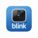

# ioBroker.blink

## blink adapter for ioBroker

ioBroker adapter for Blink cameras

## Getting started

Install via the ioBroker Admin interface : https://github.com/Pischleuder1/ioBroker.blink

## Developer manual

This adapter sets and displays the status of Amazon's Blink cameras.

The following can be accessed via the corresponding states:

* The camera can be armed/disarmed
* Currently saved videos can be retrieved
* The current snapshot of each camera can be retrieved
* The temperature of each camera  
* The battery status 
* Low battery status can be sent via Pushover or Telegram
* The status of the sync module 
* Corresponding image and video files are stored under /opt/iobroker/iobroker-data/blink
* The storage location can be set in the admin area
* Images can be written to a state in base64 format
* Automatic deletion after a time interval
* Test integration of Video Doorbell

## States
This adapter provides the following states:

### Cameras

| State | Type | Role | Explanation |
| :--- | :--- | :--- | :--- |
| **battery.LastMessage** | text | info.status | Last message via pushover |
| **battery.LastWarning** | date | info.status | Date of the last battery warning |
| **battery.low** | boolean | indicator.lowbat | True if battery is low |
| **battery.WarningSent** | boolean | indicator.maintenance | Indicates if a warning was already sent |
| **commands.clearSession** | boolean | button | Clear the current session |
| **commands.fetch_video** | boolean | button | Fetch the last saved video |
| **commands.motion_detect** | boolean | switch | Toggle motion detection (set by app) |
| **commands.snapshot** | boolean | button | Trigger a manual snapshot |
| **commands.snapshotfile** | text | value.path | Directory path of the saved snapshot |
| **info.name** | text | info.name | Name of the camera |
| **info.network_id** | text | info.name | Network ID of the camera |
| **info.serial** | text | info.serial | Serial number of the camera |
| **live.file** | text | value.path | Path and filename of the snapshot |
| **live.image_base64** | text | value.image | Base64 encoded image string |
| **live.mimetype** | text | info.type | Mimetype of the image (e.g. image/jpeg) |
| **live.timestamp** | date | value.datetime | Timestamp of the saved snapshot |
| **status.armed** | boolean | switch.enable | Camera armed status |
| **status.battery** | number | value.battery | Battery charge level in Volts |
| **status.battery_raw** | number | value.battery | Raw battery data |
| **status.motion_detect_enabled** | boolean | indicator.status | Status of motion detection |
| **status.temperature** | number | value.temperature | Temperature in Volts (raw) |
| **status.temperature_f** | number | value.temperature | Temperature in Fahrenheit |
| **video.file** | text | value.path | Filename of the last video |
| **video.id** | text | info.name | Video identification ID |
| **video.lastError** | text | info.error | Last error message |
| **video.ready** | boolean | indicator.status | Video is ready for download |
| **video.size** | number | value.size | File size of the video |
| **video.timestamp** | date | value.datetime | Timestamp of the video |

---

### Info (Global)

| State | Type | Role | Explanation |
| :--- | :--- | :--- | :--- |
| **connection** | boolean | indicator.connected | Connection status to Blink Cloud |

---

### Sync Module

| State | Type | Role | Explanation |
| :--- | :--- | :--- | :--- |
| **commands.armed** | boolean | switch.enable | Arm/Disarm sync module manually |
| **info.name** | text | info.name | Name of the sync module |
| **info.serial** | text | info.serial | Serial number of the sync module |
| **status.armed** | boolean | indicator.status | Current arming status |
| **status.last_update** | date | value.datetime | Last status update timestamp |

## DISCLAIMER

All product and company names or logos are trademarks™ or registered® trademarks of their respective holders. Use of them does not imply any affiliation with or endorsement by them or any associated subsidiaries! This personal project is maintained in spare time and has no business goal. Blink is a trademark of Amazon Technologies, Inc..

## Changelog
### 0.0.6 (2026-04-28)
* Blink PanTilt and Blink Mini - temperature_text and battery_text set to "not available" because of no built in temperature and battery indicator
* blink.0.xxx.xxx.status.wifi_strength fixed
 
### 0.0.5 (2026-04-27)
* new admin menu
* checkbox to turn log on/off

### 0.0.4 (2026-04-26)
* integrated Amazon Video Doorbell
* Log is now deleted after adapter restart
  
### 0.0.2 (2026-04-24)
* update language
* Updated Blink API integration and package metadata.
  
### 0.0.1 (2026-04-23)
* initial release

## License

MIT License

Copyright (c) 2026 Pischleuder1 <pischleuder@gmx.de>

Permission is hereby granted, free of charge, to any person obtaining a copy
of this software and associated documentation files (the "Software"), to deal
in the Software without restriction, including without limitation the rights
to use, copy, modify, merge, publish, distribute, sublicense, and/or sell
copies of the Software, and to permit persons to whom the Software is
furnished to do so, subject to the following conditions:

The above copyright notice and this permission notice shall be included in all
copies or substantial portions of the Software.

THE SOFTWARE IS PROVIDED "AS IS", WITHOUT WARRANTY OF ANY KIND, EXPRESS OR
IMPLIED, INCLUDING BUT NOT LIMITED TO THE WARRANTIES OF MERCHANTABILITY,
FITNESS FOR A PARTICULAR PURPOSE AND NONINFRINGEMENT. IN NO EVENT SHALL THE
AUTHORS OR COPYRIGHT HOLDERS BE LIABLE FOR ANY CLAIM, DAMAGES OR OTHER
LIABILITY, WHETHER IN AN ACTION OF CONTRACT, TORT OR OTHERWISE, ARISING FROM,
OUT OF OR IN CONNECTION WITH THE SOFTWARE OR THE USE OR OTHER DEALINGS IN THE
SOFTWARE.
